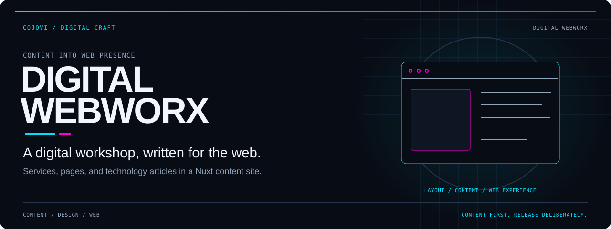
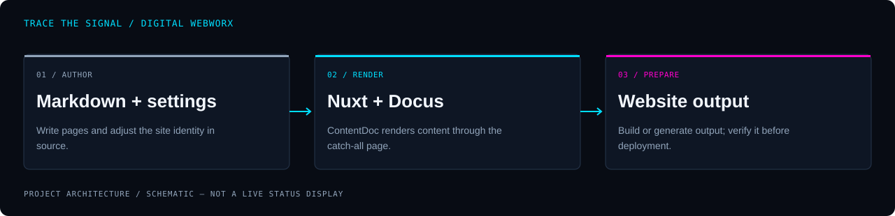

<!-- COJOVI / SIGNAL — Digital Webworx project edition. Commit with readme-assets/. -->
<a name="top"></a>

<p align="center">
  
</p>

<h1 align="center">Digital Webworx</h1>

<p align="center">
  <strong>A digital workshop, written in content and shaped for the web.</strong><br>
  A Nuxt-powered services landing page and technology-content site for Cojovi Digital Webworx.
</p>

<p align="center">
  
</p>

<p align="center">
  <a href="#overview">Overview</a> ·
  <a href="#architecture">Architecture</a> ·
  <a href="#quickstart">Quickstart</a> ·
  <a href="#configuration">Configuration</a> ·
  <a href="#content">Content</a> ·
  <a href="#security">Release notes</a>
</p>

---

<a name="overview"></a>
## `> meet_webworx`

**Digital Webworx combines a services-oriented homepage with Markdown-driven pages and articles.** The repository extends the Docus Nuxt theme and uses a catch-all Vue page to render content. Branding, navigation, social links, and layout settings live alongside the content rather than in a separate application backend.

Use it as a starting point for a content-led web presence—not as a finished client portal or a collection of the software services advertised on the homepage.

| Present | Publish | Customize |
| :--- | :--- | :--- |
| Introduce digital services through a content-authored landing page. | Maintain pages and technology articles in Markdown. | Adjust Docus branding, navigation, and layout through app configuration. |

> [!IMPORTANT]
> **This is a site source repository, with starter material still present.** Docus is the configured theme, while several content guides describe Alpine. Duplicate article trees, an inherited edit-link target, and third-party integrations need review before release. The package name remains `docus-starter`.

<a name="architecture"></a>
## `> trace_the_site`

<p align="center">
  
</p>

```text
content/*.md + content/articles/*.md
                 ↓
Nuxt + Docus theme + app.config.ts
                 ↓
app.vue → pages/[...slug].vue → ContentDoc
                 ↓
Rendered pages / production output
```

[`app.vue`](app.vue) renders `NuxtPage`; [`pages/[...slug].vue`](pages/%5B...slug%5D.vue) supplies `ContentDoc`. The project has no tracked custom API handlers or database layer. Theme-provided components and content rendering are dependencies, not implementations housed in this repository.

[`nuxt.config.ts`](nuxt.config.ts) also registers Nuxt Studio, Plausible, sitemap, and robots modules. It declares a third-party chat-loader script; its placement and runtime behavior need verification against the selected Nuxt version.

<a name="quickstart"></a>
## `> start_the_workshop`

**Prerequisites:** Git, Node.js, and a package manager compatible with the dependency tree. The manifest declares no Node engine range. The existing workflow selects pnpm 8 and declares a Node 18 matrix, but its setup-node step uses `version` rather than `node-version`; do not treat that workflow as proof of the installed runtime.

### 1. Get the site

```bash
git clone --branch main https://github.com/cojovi/digitalwebworx.git
cd digitalwebworx
```

### 2. Review, then install

Review the modules, third-party loader, and release notes below before starting a browser session. The repository contains npm, pnpm, and Yarn lockfiles; the workflow prioritizes pnpm. This example follows that selection rather than mixing package managers.

```bash
pnpm install
pnpm run dev
```

The inherited README identifies **http://localhost:3000** as the development URL; follow the actual address printed by Nuxt. Installation can execute dependency lifecycle scripts and fetch packages. Neither installation nor application startup was performed for this documentation task.

### 3. Prepare production output

```bash
pnpm run build
pnpm run preview
```

For a generated-site workflow, the manifest also provides:

```bash
pnpm run generate
```

Select the hosting preset and base URL for your own deployment. The existence of a build script is not evidence that this revision builds successfully or that a public deployment is live.

<a name="configuration"></a>
## `> shape_the_site`

| Source | What to change |
| :--- | :--- |
| [`app.config.ts`](app.config.ts) | Docus title, description, image, socials, header/footer, sidebar, and main layout. |
| [`nuxt.config.ts`](nuxt.config.ts) | Theme extension, modules, devtools, and declared chat script. |
| [`content/index.md`](content/index.md) | Services homepage, calls to action, and content components. |
| [`content/articles.md`](content/articles.md) | Article-list declaration targeting the `articles` content path. |
| [`package.json`](package.json) | Executable scripts and dependency declarations. |
| [Studio workflow](.github/workflows/studio.yml) | Build preset, package-manager selection, and publication behavior. |

**Check edit links before enabling them.** The Docus GitHub settings currently identify `cojocrib`, not `digitalwebworx`, and contain an inherited directory string. Set the correct repository and content path rather than assuming those links already edit this source.

**Keep public configuration public-only.** The Studio workflow supplies `NUXT_PUBLIC_STUDIO_API_URL` and `NUXT_PUBLIC_STUDIO_TOKENS`. Review their intended visibility and authorization scope with the service owner; do not put private credentials into public-prefixed configuration or workflow literals.

Analytics packages in the manifest are not interchangeable with enabled integrations: Plausible is in the modules list, while the Google Analytics and Vercel Analytics packages are not wired into the inspected app entrypoints. No required local `.env` contract is documented in this source.

<a name="content"></a>
## `> write_with_intent`

1. Edit the homepage in [`content/index.md`](content/index.md).
2. Update the partner/about page in [`content/about.md`](content/about.md).
3. Review existing article frontmatter and Markdown components before adding a page under [`content/articles/`](content/articles/).
4. Preview article lists, internal links, images, and narrow-screen layouts.
5. Remove or rewrite starter guidance that does not match the Docus site.

The source uses frontmatter such as `title`, `layout`, and `navigation`, plus Markdown component syntax such as `::block-hero` and `::articles-list`. The article-list component must be checked in the installed theme; it is not defined locally.

> [!NOTE]
> Homepage terminal snippets are decorative marketing copy, **not installation commands**. Article claims and linked external resources are editorial content, not verified product documentation or service guarantees.

The nested [`content/content/`](content/content/) tree repeats starter/article material, and additional article copies exist directly under `content/`. Decide which URLs should remain before publishing; changing paths may require redirects at the hosting layer.

<a name="validation"></a>
## `> check_the_output`

The manifest includes these checks/build commands:

```bash
pnpm run lint
pnpm run build
```

`lint` invokes `eslint .`, but there is no tracked ESLint configuration or direct `eslint` dependency in the manifest. Resolve the lint setup rather than assuming that command works. There is no `test` script or tracked application test suite.

- [ ] Choose one package manager and reconcile the remaining lockfiles.
- [ ] Verify the Node version and theme/dependency compatibility.
- [ ] Test `/`, `/about`, `/articles`, and individual content pages locally.
- [ ] Confirm Markdown components resolve with the configured Docus theme.
- [ ] Review duplicated content, remote images, and external links.
- [ ] Verify analytics consent, chat behavior, and metadata before release.
- [ ] Repair workflow runtime selection and review its write permissions.
- [ ] Run appropriate build and browser checks in an authorized environment.

**Builds, lint, tests, and browser/runtime checks were not run for this docs-only task.**

<a name="security"></a>
## `> publish_deliberately`

The [Studio workflow](.github/workflows/studio.yml) runs on pushes to `main` or manual dispatch, installs dependencies, adds Studio again, creates `.nuxtrc`, builds with the `github_pages` preset, and publishes `.output/public` through a deployment action. It requests repository-content write permission. Review it before pushing—even a documentation-only push matches its trigger.

The workflow contains a checked-in Studio token-like value. Its sensitivity was not tested; review it privately, revoke or rotate it if it grants private access, and use an appropriate configuration mechanism. Values are intentionally not reproduced here.

Third-party analytics, chat scripts, and remote content images can send visitor information off-site. Verify actual loading behavior, consent requirements, and external resource availability before making privacy claims. Avoid committing private configuration, personal submissions, or service credentials; [`.gitignore`](.gitignore) excludes `.env` and generated output, but is not a secret scanner.

### Attribution and licensing

This is **[cojovi/digitalwebworx](https://github.com/cojovi/digitalwebworx)**, built on Nuxt and the Docus theme. Starter-derived documentation remains in the source and should not be mistaken for custom application features.

**No root license file or package license field is present in the audited revision.** Public source visibility does not establish a blanket reuse license. Confirm permissions for project code, content, and external assets, and retain applicable dependency notices.

---

<p align="center">
  
</p>

<p align="center">
  <strong>Content first. Clear structure. Deliberate releases.</strong><br>
  <sub>A <a href="https://github.com/cojovi">Cody / cojovi</a> project · <a href="https://cojovi.com">cojovi.com</a><br>
  Built with Nuxt and Docus. Presented in COJOVI / SIGNAL.</sub>
</p>

<p align="center"><a href="#top">↑ Back to the signal</a></p>
